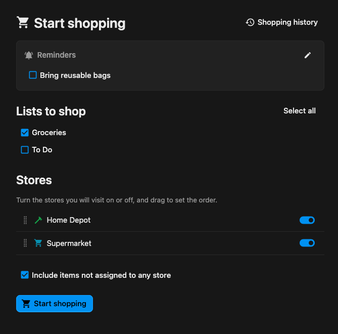
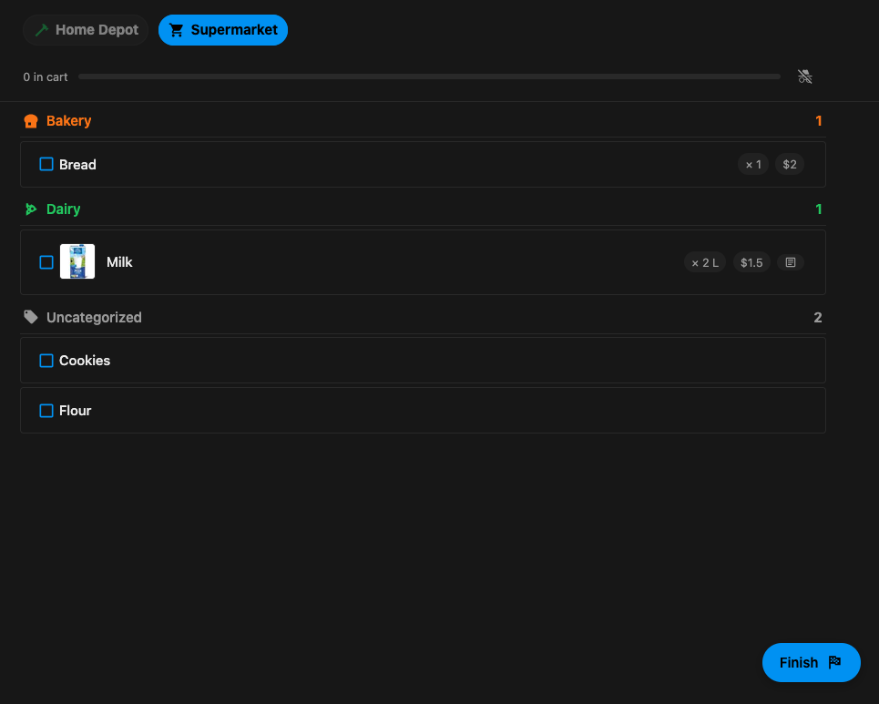
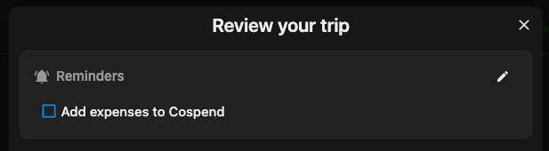
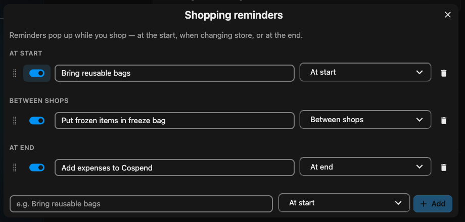
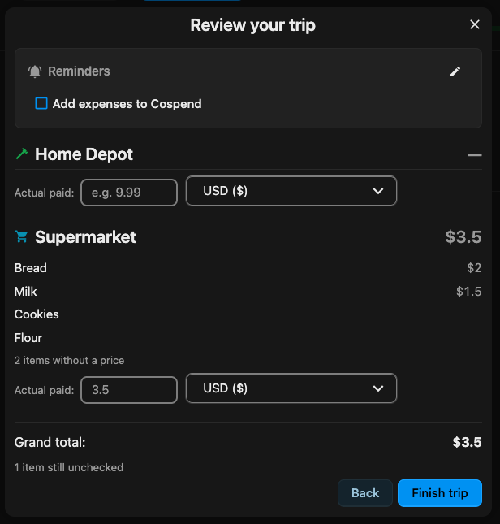
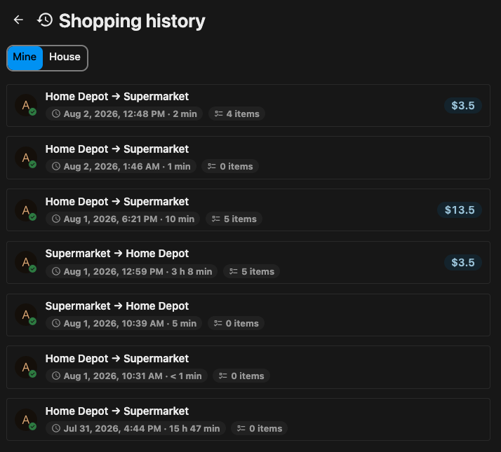

# Shopping Mode

## What it does — user-facing flow

### 1. Starting a trip

From any list (or **All Lists**) you open **Start shopping**. You pick:

- **Which checklists** to shop (pre-selected from where you launched).
- **Which stores** you'll visit, and in what order — toggle stores on/off and drag to arrange the
  route. Only stores that actually have unchecked items on the selected lists are offered.
- Whether to **include items not assigned to any store** (buy-anywhere items).

There's one live trip per person at a time. If you already have a trip running (even in another
house), you'll be offered **Resume** or **End previous trip** instead of silently starting a second
one.

### 2. Shopping

The trip view is a dense, single-column list of everything still to buy, grouped under sticky
category headers, narrowed to the **active store**. Tapping a row checks the item off — it drops out
of the list and into a **Done** drawer at the bottom (tap again to undo). A sticky bar up top shows
your store sequence and progress; tap a store to jump to it, or use the floating action button to
move to the **next store** / **finish**.

The list refreshes about once a minute (and immediately when you return to the tab), so if a
housemate checks something off, it disappears from yours too.

### 3. Presence — who's out shopping

While you shop, your session sends a lightweight heartbeat. Housemates' avatars appear on the store
bar next to the store each person is currently shopping, so nobody double-shops. Presence is
approximate and forgiving (it fades after ~15 minutes of no activity, and pauses when your tab is
backgrounded). If you'd rather not be seen, flip the **shop privately** toggle in the store bar —
your trip is hidden from housemates' presence (and later from their history).

### 4. Reminders

Households can define their own prompts — e.g. _"Bring reusable bags"_, _"Check the freezer aisle"_
— that pop up at the moment they matter: **at start**, **between shops**, or **at end**. Manage them
from **House settings → Shopping**, from the start screen, or inline while shopping. In the manager,
reminders are grouped by moment into three drag-reorderable lists; each row has an enable switch,
the text, and the moment it fires. Change a row's moment to move it between groups. When a step has
no reminders, you'll see a small empty state with an **Add reminders** button.

While shopping, enabled reminders show as a small, **non-blocking** checklist at their moment — you
can tick them off as you go, but nothing is required and the ticks are just for your own tracking
(they don't persist across a reload).

### 5. Finishing & review

When you finish a store or the whole trip you get a **review**: items grouped by the store you
bought them at, an estimated total per currency (from item prices, shown as a range when prices are
ranges), and a field to **enter what you actually paid** per store (or for the whole trip if you
shopped storeless). Finishing stamps the trip closed.

### 6. History

Finished trips land in **Shopping history** (linked from the start screen). Each row shows the store
route, item count, duration, and total; opening one shows the same read-only grouped review. You can
view just **your** trips or the whole **house's** (private trips stay hidden from housemates).
Closed trips render from a **snapshot** taken at close time, so they stay intact even if the
underlying items are later edited or deleted. Old trips can be auto-pruned via a configurable
retention period (default: keep forever).

